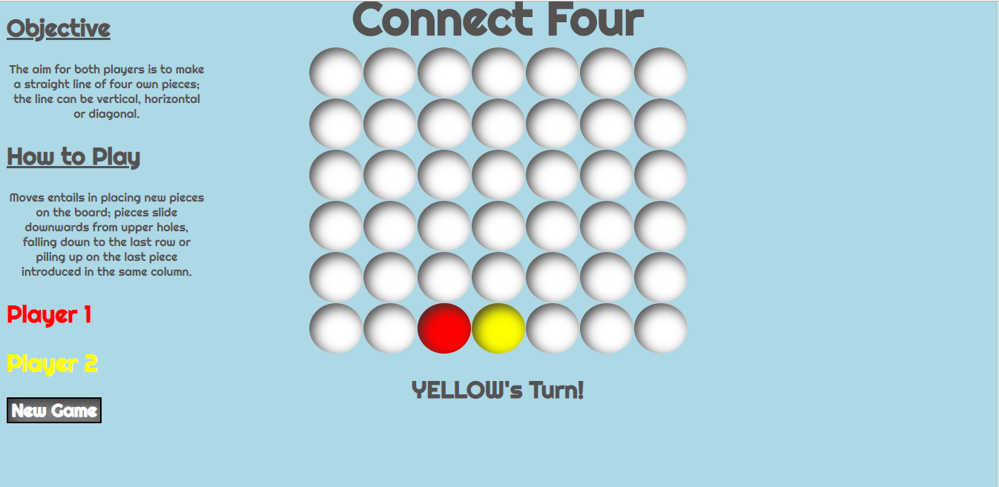
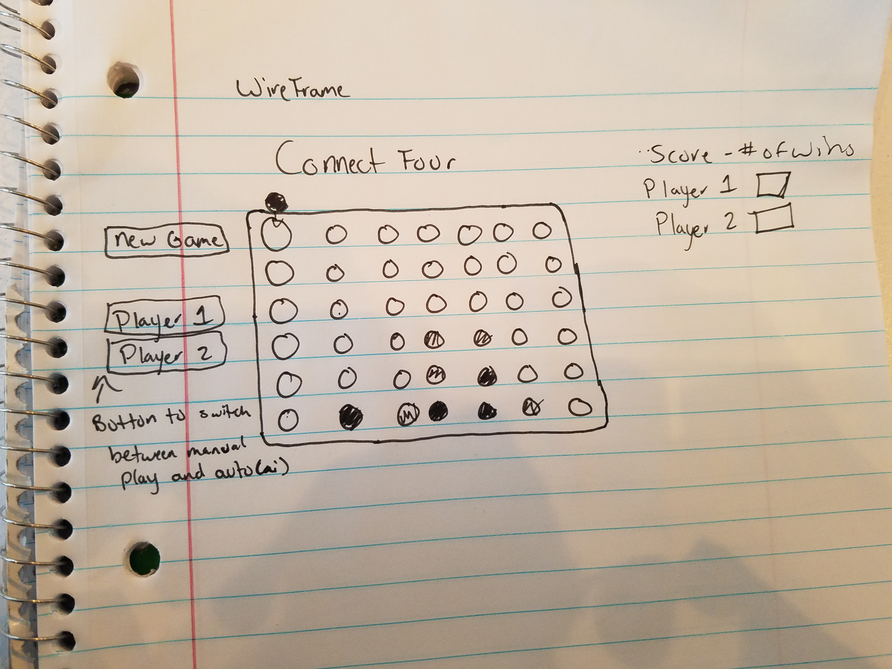

# Project1-Connect-Four
# Overview
For project 1, I created a two-player connect four game. The aim for both players is to make a straight line of four own pieces; the line can be vertical, horizontal or diagonal. Moves entails in placing new pieces on the board; pieces slide downwards from upper holes, falling down to the last row or piling up on the last piece introduced in the same column. 
- Live site - https://cameron-morgan-connect-four.netlify.com

# Technologies Used
- Languages- HTML5, CSS3, Javascript
- Design- Google Fonts
- Project Planning- Github Projects
# Features
- New Game Button
- Pieces filled with color
- Alert to Winner
# WireFrame

# Future Development
- Add A.I. 
- Make the player labels, buttons (auto or manual option)
